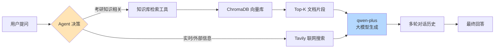

# 408 智能问答助手 · RAG + Agent 系统

> 基于 RAG 与 Agent 的计算机考研 408 智能问答系统，覆盖**操作系统 / 数据结构 / 计算机网络 / 计算机组成原理**四大科目。系统支持知识库检索、网络搜索工具调用、多轮对话上下文，并通过 60 题 LLM-as-Judge 评估方法量化对比了 3 种配置。

[](https://www.python.org/)
[](https://github.com/langchain-ai/langchain)
[](https://streamlit.io/)

## ✨ 核心特性

- 🤖 **Tool Calling Agent**：基于 LangChain `create_tool_calling_agent`，模型自主决策调用「知识库检索」或「Tavily 联网搜索」
- 📚 **RAG 知识库**：覆盖 408 全大纲四科，DashScope Embedding + ChromaDB 向量化检索
- 💬 **多轮对话上下文**：`RunnableWithMessageHistory` 实现代词消解与连续追问
- 📊 **LLM-as-Judge 量化评估**：60 题 × 3 配置对比，按科目和题型分组统计
- 🌐 **Streamlit Web 界面**：开箱即用的对话式交互

---

## 🏗️ 系统架构



**数据流**：用户问题 → Agent 语义理解 → 工具选择（KB / Web）→ 检索/搜索 → qwen-plus 综合上下文生成 → 写入对话历史 → 返回结果

---

## 🛠️ 技术栈

| 模块       | 选型                        | 说明                           |
| ---------- | --------------------------- | ------------------------------ |
| 大模型     | qwen-plus（阿里云百炼）     | 兼容 OpenAI 接口，国内访问稳定 |
| Embedding  | DashScope text-embedding-v2 | 阿里云通用 Embedding 模型      |
| 向量数据库 | ChromaDB                    | 本地持久化，零运维             |
| 框架       | LangChain                   | Agent / Chain / Memory 一站式  |
| 联网搜索   | Tavily Search               | LLM-friendly 的搜索 API        |
| Web UI     | Streamlit                   | 快速对话式界面                 |
| 评估       | LLM-as-Judge (qwen-plus)    | 业界主流评估范式（参考 RAGAS） |

---

## 📁 项目结构

rag-project/
├── data/                          # 知识库源文件（4 科 markdown）
├── db/                            # ChromaDB 向量库（自动生成）
├── evaluation/
│   ├── test_questions.json       # 60 题评估测试集
│   └── evaluation_details.json   # 每题详细评估结果
├── build_kb.py                    # 知识库构建脚本
├── rag_qa.py                      # 命令行 RAG 问答
├── agent_qa.py                    # Agent 问答（带工具调用 + 多轮记忆）
├── app.py                         # Streamlit Web 应用
├── evaluate.py                    # 评估脚本（3 配置对比）
├── evaluation_result.json         # 评估汇总结果
├── test_llm.py                    # API 连通性测试
├── requirements.txt
├── .env.example                   # 环境变量模板
└── .gitignore

---

## 🚀 快速开始

### 1. 环境准备

```bash
# 克隆项目
git clone https://github.com/panyaqi-dev/rag-agent-exam-qa.git
cd rag-agent-exam-qa

# 安装依赖（建议 Python 3.10+）
pip install -r requirements.txt
```

### 2. 配置 API Key

```bash
# 复制环境变量模板
cp .env.example .env

# 编辑 .env，填入你的 API Key：
# DASHSCOPE_API_KEY=sk-xxx  （从 https://bailian.console.aliyun.com 获取）
# TAVILY_API_KEY=tvly-xxx   （从 https://app.tavily.com 获取）
```

### 3. 准备知识库

将 408 复习笔记（markdown 格式）放入 `data/` 文件夹，建议命名为：
- `操作系统.md`
- `数据结构.md`
- `计算机网络.md`
- `计算机组成原理.md`

### 4. 构建向量库

```bash
python build_kb.py
```

### 5. 启动应用

```bash
# 方式一：命令行交互
python agent_qa.py

# 方式二：Web 界面（推荐）
streamlit run app.py
```

---

## 📊 评估结果

### 评估方法

- **测试集**：60 道精心构造的 408 题目（4 科 × 15 题），覆盖 4 种题型
- **评估方式**：LLM-as-Judge（qwen-plus 作为阅卷裁判，参考 RAGAS 评估范式）
- **配置对比**：纯 LLM / 简单 RAG / 优化 RAG 三组

### 题目分布

| 科目           | 题数 | 题型                      | 题数 |
| -------------- | ---- | ------------------------- | ---- |
| 操作系统       | 15   | fact（基础事实）          | 20   |
| 数据结构       | 15   | concept（概念辨析）       | 16   |
| 计算机网络     | 15   | application（应用计算）   | 16   |
| 计算机组成原理 | 15   | hallucination（幻觉拒答） | 8    |

### 总体准确率

| 配置            | 说明                     | 准确率      | 通过/总数 |
| --------------- | ------------------------ | ----------- | --------- |
| `no_rag`        | 纯 qwen-plus，不接知识库 | 85.0%       | 51/60     |
| `basic_rag`     | 简单 prompt + top_k=1    | **95.0%** 🏆 | 57/60     |
| `optimized_rag` | CoT prompt + top_k=3     | 90.0%       | 54/60     |

**核心提升**：加入 RAG 后，准确率从 85% 提升至 95%（**+10 个百分点**），证明 RAG 检索机制对 408 这种知识密集型任务有显著价值。

### 按题型分项

| 题型                      | no_rag | basic_rag  | optimized_rag |
| ------------------------- | ------ | ---------- | ------------- |
| fact（基础事实）          | 100.0% | **100.0%** | **100.0%**    |
| concept（概念辨析）       | 87.5%  | **100.0%** | **100.0%**    |
| application（应用计算）   | 87.5%  | 87.5%      | 87.5%         |
| hallucination（幻觉拒答） | 37.5%  | **87.5%**  | 50.0%         |

### 按科目分项（basic_rag 最优配置）

| 科目           | 准确率 | 通过/总数 |
| -------------- | ------ | --------- |
| 操作系统       | 100.0% | 15/15     |
| 计算机组成原理 | 100.0% | 15/15     |
| 计算机网络     | 93.3%  | 14/15     |
| 数据结构       | 86.7%  | 13/15     |

---

## 🔍 关键工程发现

### 发现 1：RAG 显著降低幻觉率

无 RAG 时，模型对知识库不存在的问题（如"量子信号量机制"）幻觉拒答率仅 **37.5%**——会虚构编造答案。
引入 RAG 后，因检索结果为空可作为"无相关内容"的判断依据，幻觉拒答率提升至 **87.5%**（+50 个百分点）。

> 这印证了 RAG 不仅是"知识增强"，更是"幻觉抑制"机制。

### 发现 2：复杂 prompt 反而损害 hallucination 检测

`optimized_rag` 中加入 "参考资料不足时可结合专业知识补充" 的指令后：
- ✅ application 类正确率维持 87.5%（CoT 推导步骤帮助）
- ❌ hallucination 拒答率从 87.5% 降至 50.0%（**模型用通用知识"补足"了虚构问题**）

**结论**：在 baseline 已经表现良好的场景下，过度工程化的 prompt 会引入新的失败模式。**简洁的 prompt 往往更鲁棒**——这与近期 LLM 工程领域的研究趋势一致。

### 发现 3：application 类是 RAG 的天花板

无论哪种配置，应用计算类（如磁盘 I/O 时间计算）都稳定在 87.5%——RAG 的优势在于**知识获取**，而非**多步数学推理**。该类问题的进一步优化方向：

- 引入 **Chain-of-Thought + Self-Consistency** 机制
- 接入数学计算工具（Tool Calling Calculator）
- 使用更大的推理模型（如 qwen-max / DeepSeek-R1）

---

## 🗺️ 后续优化方向

- [ ] **检索质量优化**：引入 BM25 + 向量混合检索 + Reranker
- [ ] **应用题专项**：Chain-of-Thought + 数学工具调用
- [ ] **评估自动化**：CI 中持续跑评估，监控版本迭代质量
- [ ] **多语言支持**：扩展英文 408 学习内容（适配国际学生）
- [ ] **历史回溯**：对话历史持久化到数据库（当前仅会话内存）

---

## 📄 License

MIT License